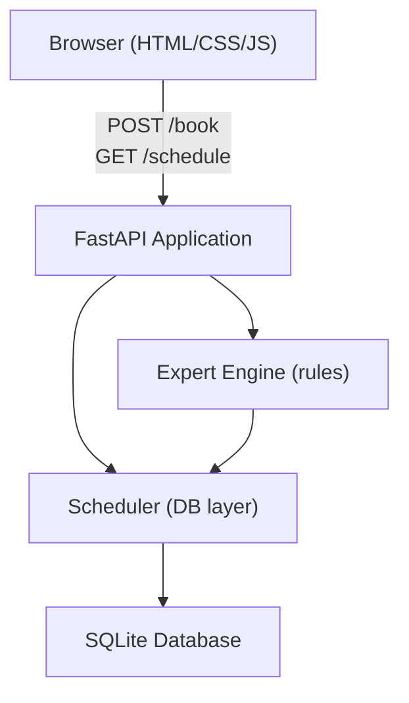

# Design Document: Hall Booking Expert System

## Overview

The Hall Booking Expert System is a full-stack web application that manages reservations for 6 halls across fixed weekly time slots. The backend is built with FastAPI and SQLite; the frontend is vanilla HTML/CSS/JavaScript. A rule-based Expert Engine handles conflict detection and alternative suggestions.

The system is intentionally simple and beginner-friendly: no authentication, no async task queues, no external services. All intelligence lives in the Expert Engine as pure Python functions.

---

## Architecture



**Request flow for POST /book:**
1. Browser submits booking form → POST /book
2. FastAPI validates the request body (Pydantic)
3. Expert Engine checks for conflicts via Scheduler
4. If conflict → return 409 with suggestions
5. If free → Scheduler writes to SQLite → return 201

**Request flow for GET /schedule:**
1. Browser loads page or refreshes → GET /schedule
2. Scheduler queries all bookings from SQLite
3. System builds a full grid (all halls × all days × all slots)
4. Return JSON grid → Browser renders timetable

---

## Components and Interfaces

### Backend Components

#### `config.py`
Holds all static configuration:
- `HALLS`: list of 6 hall names
- `DAYS`: list of 7 day names
- `TIME_SLOTS`: list of (start_time, end_time) tuples
- `CONTACT_NUMBER`: static admin phone number string

#### `database.py`
Manages SQLite connection and table creation:
- `get_connection()` → returns a `sqlite3.Connection`
- `init_db()` → creates the `bookings` table if not exists

#### `scheduler.py`
Data access layer — all SQL lives here:
- `create_booking(hall, day, start_time, end_time, booked_by)` → inserts a row
- `get_booking(hall, day, start_time)` → returns a booking row or None
- `get_all_bookings()` → returns all rows
- `get_bookings_by_hall(hall)` → returns all bookings for a hall
- `get_bookings_by_slot(day, start_time)` → returns all bookings for a slot

#### `expert_engine.py`
Rule-based logic — no ML, pure Python:
- `check_conflict(hall, day, start_time)` → bool
- `suggest_alternatives(hall, day, start_time)` → dict with keys:
  - `free_halls`: halls free at same day+slot
  - `free_slots`: slots free for same hall+day
  - `recommended_hall`: least-used hall
  - `recommended_slot`: slot with highest availability
  - `contact_number`: static value from config

#### `models.py`
Pydantic models:
- `BookingRequest`: hall, day, start_time, end_time, booked_by
- `BookingResponse`: booking details + success message
- `ConflictResponse`: message, free_halls, free_slots, recommended_hall, recommended_slot, contact_number

#### `main.py`
FastAPI app with two routes:
- `POST /book` → validate → expert engine → scheduler → response
- `GET /schedule` → scheduler → build grid → response

### Frontend Components

#### `index.html`
Single-page layout:
- Header with app title and contact number
- Booking form section
- Timetable grid section

#### `style.css`
- Green cells for free slots
- Red cells for booked slots
- Responsive table layout

#### `app.js`
- `loadSchedule()` → fetch GET /schedule → render timetable
- `submitBooking(event)` → fetch POST /book → handle success/conflict
- `renderTimetable(data)` → build HTML table from schedule JSON
- `showConflict(data)` → display conflict message and suggestions

---

## Data Models

### SQLite Table: `bookings`

| Column     | Type    | Constraints         |
|------------|---------|---------------------|
| id         | INTEGER | PRIMARY KEY AUTOINCREMENT |
| hall       | TEXT    | NOT NULL            |
| day        | TEXT    | NOT NULL            |
| start_time | TEXT    | NOT NULL            |
| end_time   | TEXT    | NOT NULL            |
| booked_by  | TEXT    | NOT NULL            |

Unique constraint: `(hall, day, start_time)` — enforced at application layer by the Expert Engine before insert.

### Pydantic: `BookingRequest`

```python
class BookingRequest(BaseModel):
    hall: str        # e.g. "Hall A"
    day: str         # e.g. "Monday"
    start_time: str  # e.g. "08:30"
    end_time: str    # e.g. "10:30"
    booked_by: str   # non-empty name
```

### Schedule Response Shape

```json
{
  "schedule": {
    "Monday": {
      "08:30": {
        "Hall A": { "status": "Free", "booked_by": null },
        "Hall B": { "status": "Booked", "booked_by": "Alice" }
      }
    }
  }
}
```

---

## Correctness Properties

*A property is a characteristic or behavior that should hold true across all valid executions of a system — essentially, a formal statement about what the system should do. Properties serve as the bridge between human-readable specifications and machine-verifiable correctness guarantees.*

### Property 1: No double-booking invariant

*For any* hall, day, and time slot, after a successful booking is created, any subsequent booking attempt for the same hall, day, and time slot must be rejected with a conflict response.

**Validates: Requirements 3.1, 3.3**

---

### Property 2: Cross-hall independence

*For any* day and time slot, booking Hall X does not affect the availability of Hall Y (where X ≠ Y). After booking Hall X, Hall Y must still be bookable at the same day and time slot.

**Validates: Requirements 3.2**

---

### Property 3: Conflict suggestions completeness

*For any* conflict scenario (hall H, day D, slot S), the list of `free_halls` returned by `suggest_alternatives` must contain exactly those halls that have no booking for day D and slot S, and must not contain hall H.

**Validates: Requirements 4.1**

---

### Property 4: Free slots completeness

*For any* conflict scenario (hall H, day D, slot S), the list of `free_slots` returned by `suggest_alternatives` must contain exactly those time slots on day D for which hall H has no booking.

**Validates: Requirements 4.2**

---

### Property 5: Least-used hall recommendation

*For any* set of bookings, the `recommended_hall` returned by `suggest_alternatives` must be the hall with the fewest total bookings across all days and slots. In case of a tie, any tied hall is acceptable.

**Validates: Requirements 4.4**

---

### Property 6: Schedule completeness

*For any* database state, the GET /schedule response must contain an entry for every combination of the 7 days × 5 time slots × 6 halls (210 cells total), with no missing cells.

**Validates: Requirements 5.1, 5.3**

---

### Property 7: Booking round-trip

*For any* valid booking (hall, day, start_time, end_time, booked_by), after a successful POST /book, the GET /schedule response must show that cell as "Booked" with the correct `booked_by` value.

**Validates: Requirements 2.1, 2.2, 5.2**

---

### Property 8: Input validation rejects invalid enums

*For any* booking request where hall, day, or time slot is not in the defined allowed lists, the system must return a 422 error and must not write any row to the database.

**Validates: Requirements 1.4, 1.5, 1.6, 8.3**

---

## Error Handling

| Scenario | HTTP Status | Response |
|---|---|---|
| Valid booking, no conflict | 201 | Booking details |
| Conflict detected | 409 | Conflict message + suggestions + contact number |
| Invalid hall/day/slot value | 422 | Pydantic validation error |
| Empty booked_by | 422 | Validation error |
| GET /schedule (any state) | 200 | Full schedule grid |

All errors are returned as JSON. The frontend reads the status code to decide whether to show a success message or a conflict panel.

---

## Testing Strategy

### Dual Testing Approach

Both unit tests and property-based tests are used. They are complementary:
- Unit tests catch concrete bugs with specific known inputs
- Property tests verify universal correctness across randomly generated inputs

### Unit Tests (`backend/tests/test_unit.py`)

Focus on:
- Specific booking creation and retrieval examples
- Conflict detection with known fixtures
- Validation rejection for bad enum values and empty names
- Schedule endpoint returns 200 with correct shape
- Conflict response includes contact number

### Property-Based Tests (`backend/tests/test_properties.py`)

Library: **Hypothesis** (Python)

Each property test runs a minimum of 100 iterations.

| Test | Design Property | Tag |
|---|---|---|
| No double-booking invariant | Property 1 | `Feature: hall-booking-expert-system, Property 1` |
| Cross-hall independence | Property 2 | `Feature: hall-booking-expert-system, Property 2` |
| Conflict suggestions completeness | Property 3 | `Feature: hall-booking-expert-system, Property 3` |
| Free slots completeness | Property 4 | `Feature: hall-booking-expert-system, Property 4` |
| Least-used hall recommendation | Property 5 | `Feature: hall-booking-expert-system, Property 5` |
| Schedule completeness | Property 6 | `Feature: hall-booking-expert-system, Property 6` |
| Booking round-trip | Property 7 | `Feature: hall-booking-expert-system, Property 7` |
| Input validation rejects invalid enums | Property 8 | `Feature: hall-booking-expert-system, Property 8` |

**Generators needed:**
- `st.sampled_from(HALLS)` for valid halls
- `st.sampled_from(DAYS)` for valid days
- `st.sampled_from(TIME_SLOTS)` for valid slots
- `st.text(min_size=1)` for booker names
- `st.text()` for invalid enum values (filtered to exclude valid values)

Each property test uses an in-memory SQLite database (`:memory:`) to avoid test pollution.
