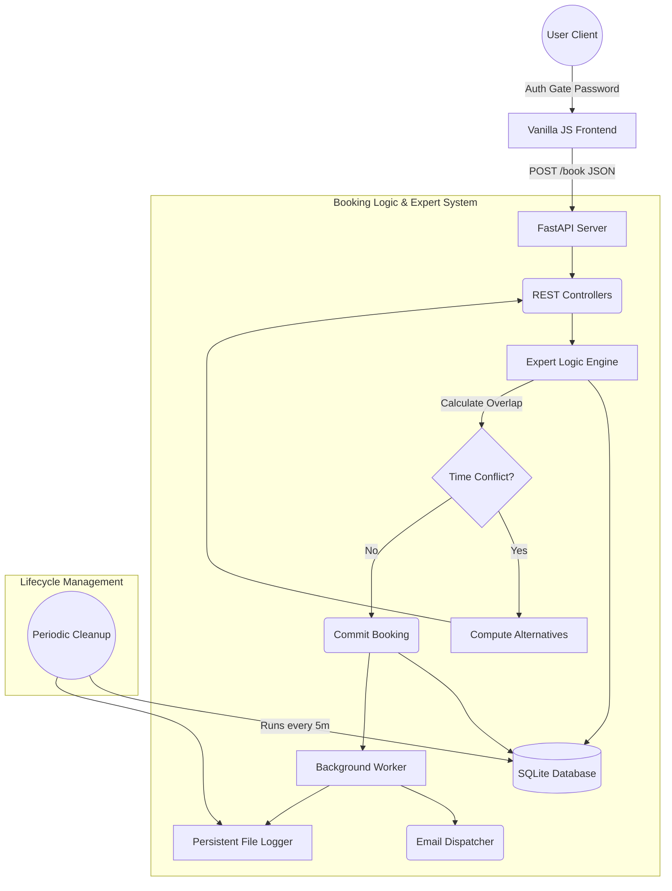

# 🏛️ Hall Booking Expert System

<div align="center">
  
  
  
  
</div>

<br>

An AI-powered, meticulously designed Hall Booking System featuring dynamic chronological scheduling, robust conflict detection algorithms, autonomous expired-booking cleanups, and a fully unified deployment-ready architecture.

---

## 🌟 Key Features

- **Dynamic Precision Scheduling**: Break free from rigid time slots. Book any arbitrary start and end time precisely defined by your exact date requirements.
- **Expert-Tier Conflict Resolver**: Advanced collision detection algorithms mathematically prevent overlapping intervals and intelligently suggest the closest available windows.
- **Open Schedule & Admin Gate**: Everyone can view the schedule, while booking and cancellation features are protected by an elegant Admin Login UI.
- **Cancel Bookings**: Admins can seamlessly cancel active bookings with a tracked reason to maintain accurate schedules.
- **Strict Time Validation**: Frontend and backend algorithms inherently prevent booking dates or times in the past.
- **Persistent Audit Logging**: Real-time chronological tracking of all successful bookings, errors, and background system cleanups seamlessly recorded to `bookings.log`.
- **Automated Expired Cleanups**: A background worker iteratively scrubs past reservations every 5 minutes natively utilizing asyncio.
- **SMTP Email Notifications**: Built-in credential-masked `.env` infrastructure to seamlessly dispatch rich HTML email confirmations upon booking success.
- **Unified Single-Server Deployment**: The Python backend hosts both the REST API and the static frontend assets dynamically off the root `/` port.

---

## 🧠 System Architecture & Logic Flow

The Hall Booking Expert System processes requests through a rigorous validation engine before assigning records to the datastore.



---

## 🚀 Installation & Quick Start

### 1. Prerequisites
- **Python 3.8+**
- Git

### 2. Setup

Clone the repository and install the required dependencies:
```bash
git clone https://github.com/samyakdande/Expert-System-HallBooking.git
cd Expert-System-HallBooking
pip install -r backend/requirements.txt
```

### 3. Email Configuration (Optional)
To enable live email dispatching rather than local logging, copy the template and insert your credentials:
```bash
cp backend/.env.template backend/.env
# Edit .env with your SMTP_USERNAME and SMTP_PASSWORD
```

### 4. Booting the Server
Thanks to the unified architecture, starting the backend automatically serves the frontend!
```bash
python -m uvicorn backend.main:app --host 0.0.0.0 --port 8000
```
Simply pop open **`http://localhost:8000`** in your browser! The default authentication key for the UI is `expert2026` or `admin123`.

---

## 🔧 RESTful API Endpoints

### `POST /book`
Triggers the expert logic engine to evaluate and secure a hall constraint.

**Request Body:**
```json
{
  "hall": "Hall A",
  "date": "2026-04-12",
  "start_time": "09:00",
  "end_time": "11:00",
  "email": "user@example.com",
  "booked_by": "John Doe",
  "purpose": "Quarterly Planning"
}
```

**Responses:**
- `201 Created`: Booking successfully secured and logged.
- `409 Conflict`: Automatically returns intelligently computed alternative time slots and alternate halls!

### `GET /schedule`
Returns the comprehensively nested dictionary hierarchy of all secured bookings dynamically segmented by date > start_time > hall.

### `POST /cancel`
Allows admins to cancel an active booking by submitting the hall, date, start time, and cancellation reason. Automatically logs the action and reason.

### `POST /cleanup`
Manually trigger an asynchronous iteration that wipes elapsed datastore entries chronologically.

---

## 🧪 Testing Environment

The project features a full Pytest integration suite simulating isolated in-memory DB setups, avoiding any mutations on your production pipeline.
```bash
pytest backend/tests/ -v
```

---
*Developed & Maintained by Samyak Dande.*
